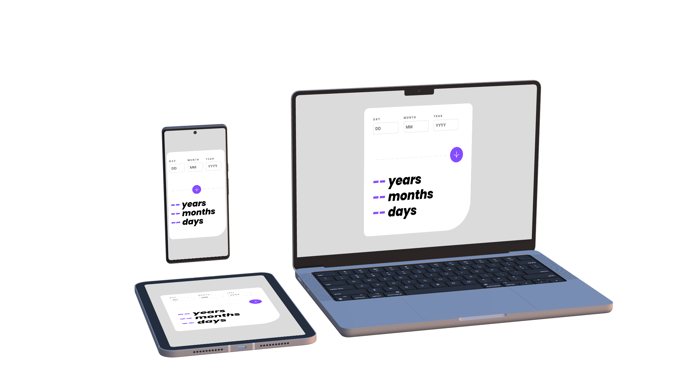

# Frontend Mentor - Age calculator app

This is a solution to the [Age calculator app challenge on Frontend Mentor](https://www.frontendmentor.io/challenges/age-calculator-app-dF9DFFpj-Q). Frontend Mentor challenges help you improve your coding skills by building realistic projects.

## Table of contents

- [Frontend Mentor - Age calculator app](#frontend-mentor---age-calculator-app)
  - [Table of contents](#table-of-contents)
  - [Overview](#overview)
    - [The challenge](#the-challenge)
    - [Screenshot](#screenshot)
    - [Links](#links)
  - [My process](#my-process)
    - [Built with](#built-with)
    - [What I learned](#what-i-learned)
    - [Continued development](#continued-development)
  - [Author](#author)

## Overview

### The challenge

Users should be able to:

- View an age in years, months, and days after submitting a valid date through the form
- Receive validation errors if:
  - Any field is empty when the form is submitted
  - The day number is not between 1-31
  - The month number is not between 1-12
  - The date is in the future
    -The date is invalid, e.g. 31/04/1991 (there are 30 days in April)
- View the optimal layout for the interface depending on their device's screen size
- See hover and focus states for all interactive elements on the page
- Bonus: See the age numbers animate to their final number when the form is submitted

### Screenshot

### Links

- [Solution URL](https://www.frontendmentor.io/solutions/responsive-age-calculator-app-using-html-css-js-_atjigcWk_)
- [Live Site URL](https://ohsorrow.github.io/age-calculator-app)

## My process

### Built with

- Semantic HTML5 markup
- CSS custom properties
- Flexbox
- Mobile-first workflow

### What I learned

- Using [CountUp.js](https://inorganik.github.io/countUp.js/) library to animate the age numbers
- Difference between `<input type="button">` and `button`: the main advantage of the `<button>` element is that the `<input>` element only allows plain text in its label whereas the `<button>` element allows full HTML content, allowing more complex, creative button content.
- What is a void element in HTML: A void element is an element that cannot have any child nodes (i.e., nested elements or text nodes). Void elements only have a start tag; end tags must not be specified for void elements.
- What is `enterkeyhint` attribute in HTML: The `enterkeyhint` attribute allows you to change the appearance of the "Enter" key on a virtual keyboard.
- How to connect three consecutive inputs in such a way that when each one is filled, it focuses on the next one, and when backspacing in each one (if it is empty), it focuses on the previous input. I also add the arrow key functionality to the inputs. When the user presses the right arrow key, it moves the caret cursor to the right, and when the user presses the left arrow key, it moves the caret cursor to the left. I used the following code to achieve this functionality:

### Continued development

Though I'm pleased with my progress, web development offers endless room for improvement. I'm excited to keep refining my skills in future projects. Consistently learning and challenging myself is what helps me grow as a developer.

## Author

My profile on:

- [Frontend Mentor](https://www.frontendmentor.io/profile/OhSorrow)
- [LinkedIn](https://www.linkedin.com/in/aram-moradian/)
